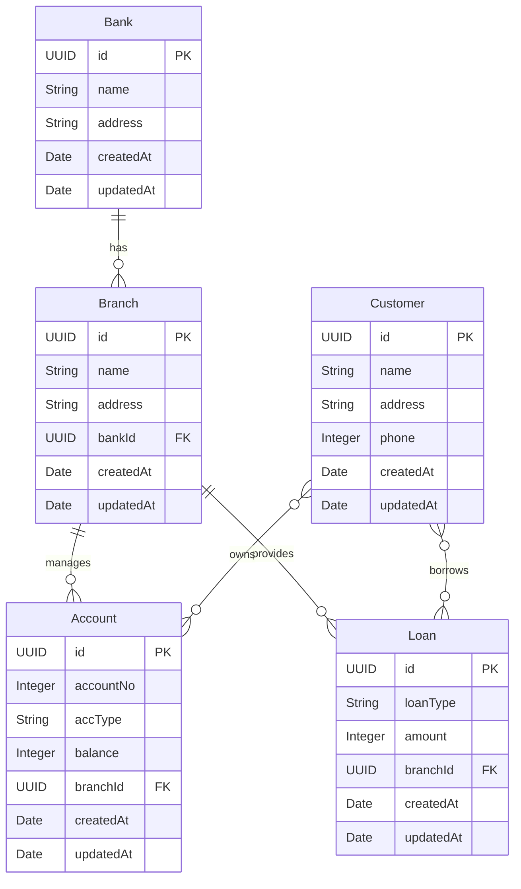

# 🏦 Banking Application - Java Spring Boot Learning Project

[](https://www.oracle.com/java/)
[](https://spring.io/projects/spring-boot)
[](https://www.mysql.com/)
[]()

> **Learning Path Project**: This is a comprehensive Java and Spring Boot learning project that demonstrates building a complete RESTful API for a banking system with CRUD operations, JPA relationships, and layered architecture.

---

## 📚 About This Project

This project is part of my **Java and Spring Boot learning journey**. It demonstrates the implementation of a full-stack banking application backend using modern Java technologies and best practices. The application manages banks, branches, accounts, customers, and loans with complete CRUD operations and relationship management.

### 🎯 Learning Objectives

- ✅ Master Spring Boot framework fundamentals
- ✅ Implement RESTful API design patterns
- ✅ Work with Spring Data JPA and Hibernate
- ✅ Understand entity relationships (OneToMany, ManyToOne, ManyToMany)
- ✅ Apply layered architecture (Controller → Service → Repository)
- ✅ Use DTOs (Data Transfer Objects) for clean API design
- ✅ Integrate MySQL database with Spring Boot
- ✅ Practice dependency injection and IoC principles

---

## 🛠️ Technologies & Tools

### Core Technologies

| Technology          | Version   | Purpose                       |
| ------------------- | --------- | ----------------------------- |
| **Java**            | 17        | Programming Language          |
| **Spring Boot**     | 4.0.0     | Application Framework         |
| **Spring Data JPA** | 4.0.0     | Data Access Layer             |
| **Hibernate**       | (via JPA) | ORM Framework                 |
| **MySQL**           | 8.0+      | Relational Database           |
| **Maven**           | 3.x       | Build & Dependency Management |

### Key Dependencies

- **Spring Boot Starter Web** - RESTful web services
- **Spring Boot Starter Data JPA** - Database operations
- **Spring Boot Starter Validation** - Input validation
- **Spring Boot Actuator** - Application monitoring
- **Lombok** - Reduce boilerplate code
- **MySQL Connector** - Database driver
- **Spring Boot DevTools** - Development utilities

---

## 🏗️ Project Architecture

### Layered Architecture Pattern

```
┌─────────────────────────────────────────┐
│         REST Controllers                │  ← HTTP Endpoints
│  (BankController, BranchController...)  │
└────────────────┬────────────────────────┘
                 │
┌────────────────▼────────────────────────┐
│         Service Layer                   │  ← Business Logic
│  (BankServiceImp, BranchServiceImp...)  │
└────────────────┬────────────────────────┘
                 │
┌────────────────▼────────────────────────┐
│         Repository Layer                │  ← Data Access
│  (BankRepository, BranchRepository...)  │
└────────────────┬────────────────────────┘
                 │
┌────────────────▼────────────────────────┐
│         Database (MySQL)                │  ← Persistence
│         bankingApp                      │
└─────────────────────────────────────────┘
```

### Project Structure

```
banking-app/
├── src/main/java/com/gharib/banking/
│   ├── Abstract/              # Base interfaces
│   │   ├── BaseRepo.java
│   │   ├── BaseService.java
│   │   ├── BankService.java
│   │   ├── BranchService.java
│   │   ├── AccountService.java
│   │   ├── CustomerService.java
│   │   └── LoanService.java
│   │
│   ├── Controllers/           # REST endpoints
│   │   ├── BankController.java
│   │   ├── BranchController.java
│   │   ├── AccountController.java
│   │   ├── CustomerController.java
│   │   └── LoanController.java
│   │
│   ├── services/              # Business logic
│   │   ├── BankServiceImp.java
│   │   ├── BranchServiceImp.java
│   │   ├── AccountServiceImp.java
│   │   ├── CustomerServiceImp.java
│   │   └── LoanServiceImp.java
│   │
│   ├── repos/                 # Data access
│   │   ├── BankRepository.java
│   │   ├── BranchRepository.java
│   │   ├── AccountRepository.java
│   │   ├── CustomerRepository.java
│   │   └── LoanRepository.java
│   │
│   ├── models/                # Entity classes
│   │   ├── BaseEntity.java
│   │   ├── Bank.java
│   │   ├── Branch.java
│   │   ├── Account.java
│   │   ├── Customer.java
│   │   ├── Loan.java
│   │   └── Dto/               # Data Transfer Objects
│   │       ├── BankReq.java / BankRes.java
│   │       ├── BranchReq.java / BranchRes.java
│   │       ├── AccountReq.java / AccountRes.java
│   │       ├── CustomerReq.java / CustomerRes.java
│   │       └── LoanReq.java / LoanRes.java
│   │
│   └── BankingAppApplication.java
│
└── src/main/resources/
    └── application.properties
```

---

## 📊 Database Schema

### Entity Relationships



### Key Relationships

- **Bank → Branch**: One-to-Many (A bank has multiple branches)
- **Branch → Account**: One-to-Many (A branch manages multiple accounts)
- **Branch → Loan**: One-to-Many (A branch provides multiple loans)
- **Customer ↔ Account**: Many-to-Many (Customers can have multiple accounts, accounts can have multiple owners)
- **Customer ↔ Loan**: Many-to-Many (Customers can have multiple loans, loans can have multiple borrowers)

---

## 🚀 Getting Started

### Prerequisites

- **Java 17** or higher
- **MySQL 8.0** or higher
- **Maven 3.x** (or use included Maven wrapper)
- **IDE** (IntelliJ IDEA, Eclipse, or VS Code recommended)

### Installation Steps

1. **Clone the repository**

   ```bash
   git clone <repository-url>
   cd banking-app
   ```

2. **Create MySQL Database**

   ```sql
   CREATE DATABASE bankingApp;
   ```

3. **Configure Database Connection**

   Edit `src/main/resources/application.properties`:

   ```properties
   spring.datasource.url=jdbc:mysql://localhost:3306/bankingApp
   spring.datasource.username=your_username
   spring.datasource.password=your_password
   ```

4. **Build the Project**

   ```bash
   # Using Maven wrapper (recommended)
   ./mvnw clean install

   # Or using Maven directly
   mvn clean install
   ```

5. **Run the Application**

   ```bash
   # Using Maven wrapper
   ./mvnw spring-boot:run

   # Or using Maven
   mvn spring-boot:run
   ```

6. **Access the Application**

   The API will be available at: `http://localhost:8080`

---

## 📡 API Endpoints

### Bank Endpoints

| Method | Endpoint                              | Description       |
| ------ | ------------------------------------- | ----------------- |
| GET    | `/api/banks`                          | Get all banks     |
| GET    | `/api/banks/{id}`                     | Get bank by ID    |
| GET    | `/api/banks/search?name={name}`       | Search by name    |
| GET    | `/api/banks/search?address={address}` | Search by address |
| POST   | `/api/banks`                          | Create new bank   |
| PUT    | `/api/banks/{id}`                     | Update bank       |
| DELETE | `/api/banks/{id}`                     | Delete bank       |

### Branch Endpoints

| Method | Endpoint                               | Description          |
| ------ | -------------------------------------- | -------------------- |
| GET    | `/api/branches`                        | Get all branches     |
| GET    | `/api/branches/{id}`                   | Get branch by ID     |
| GET    | `/api/branches/search?name={name}`     | Search by name       |
| GET    | `/api/branches/search?bankId={bankId}` | Get branches by bank |
| POST   | `/api/branches`                        | Create new branch    |
| PUT    | `/api/branches/{id}`                   | Update branch        |
| DELETE | `/api/branches/{id}`                   | Delete branch        |

### Account Endpoints

| Method | Endpoint                                     | Description              |
| ------ | -------------------------------------------- | ------------------------ |
| GET    | `/api/accounts`                              | Get all accounts         |
| GET    | `/api/accounts/{id}`                         | Get account by ID        |
| GET    | `/api/accounts/search?accountNo={accountNo}` | Search by account number |
| GET    | `/api/accounts/search?branchId={branchId}`   | Get accounts by branch   |
| POST   | `/api/accounts`                              | Create new account       |
| PUT    | `/api/accounts/{id}`                         | Update account           |
| DELETE | `/api/accounts/{id}`                         | Delete account           |

### Customer Endpoints

| Method | Endpoint                              | Description         |
| ------ | ------------------------------------- | ------------------- |
| GET    | `/api/customers`                      | Get all customers   |
| GET    | `/api/customers/{id}`                 | Get customer by ID  |
| GET    | `/api/customers/search?name={name}`   | Search by name      |
| GET    | `/api/customers/search?phone={phone}` | Search by phone     |
| POST   | `/api/customers`                      | Create new customer |
| PUT    | `/api/customers/{id}`                 | Update customer     |
| DELETE | `/api/customers/{id}`                 | Delete customer     |

### Loan Endpoints

| Method | Endpoint                                | Description         |
| ------ | --------------------------------------- | ------------------- |
| GET    | `/api/loans`                            | Get all loans       |
| GET    | `/api/loans/{id}`                       | Get loan by ID      |
| GET    | `/api/loans/search?loanType={loanType}` | Search by loan type |
| GET    | `/api/loans/search?branchId={branchId}` | Get loans by branch |
| POST   | `/api/loans`                            | Create new loan     |
| PUT    | `/api/loans/{id}`                       | Update loan         |
| DELETE | `/api/loans/{id}`                       | Delete loan         |

---

## 💡 Example API Usage

### Create a Bank

```bash
curl -X POST http://localhost:8080/api/banks \
  -H "Content-Type: application/json" \
  -d '{
    "name": "National Bank",
    "address": "123 Main Street, City"
  }'
```

**Response:**

```json
{
  "id": "550e8400-e29b-41d4-a716-446655440000",
  "name": "National Bank",
  "address": "123 Main Street, City",
  "createdAt": "2025-12-08T10:00:00",
  "updatedAt": "2025-12-08T10:00:00"
}
```

### Create a Branch

```bash
curl -X POST http://localhost:8080/api/branches \
  -H "Content-Type: application/json" \
  -d '{
    "name": "Downtown Branch",
    "address": "456 Oak Avenue",
    "bankId": "550e8400-e29b-41d4-a716-446655440000"
  }'
```

### Get All Customers

```bash
curl http://localhost:8080/api/customers
```

---

## 🎓 Key Concepts Learned

### 1. **Spring Boot Auto-Configuration**

- Automatic configuration of DataSource, JPA, and Web components
- Convention over configuration approach

### 2. **Dependency Injection**

- Using `@Autowired` for automatic dependency injection
- Constructor injection vs field injection

### 3. **JPA Annotations**

- `@Entity`, `@Table`, `@Id`, `@GeneratedValue`
- `@OneToMany`, `@ManyToOne`, `@ManyToMany`
- `@JoinColumn`, `@JoinTable`
- `@JsonManagedReference`, `@JsonBackReference`

### 4. **Repository Pattern**

- Extending `JpaRepository` for CRUD operations
- Custom query methods using method naming conventions
- `@Repository` annotation

### 5. **Service Layer Pattern**

- Business logic separation
- `@Service` annotation
- Interface-based design

### 6. **REST Controller**

- `@RestController`, `@RequestMapping`
- `@GetMapping`, `@PostMapping`, `@PutMapping`, `@DeleteMapping`
- `@PathVariable`, `@RequestParam`, `@RequestBody`

### 7. **DTO Pattern**

- Separating internal entities from API contracts
- Request/Response DTOs
- Preventing circular references in JSON serialization

### 8. **Lombok**

- `@Data`, `@Getter`, `@Setter`
- `@AllArgsConstructor`, `@NoArgsConstructor`
- Reducing boilerplate code

---

## 🔧 Configuration

### Application Properties

```properties
# Application Name
spring.application.name=banking-app

# Database Configuration
spring.datasource.url=jdbc:mysql://localhost:3306/bankingApp
spring.datasource.username=root
spring.datasource.password=12345
spring.datasource.driver-class-name=com.mysql.cj.jdbc.Driver

# JPA/Hibernate Configuration
spring.jpa.show-sql=true
spring.jpa.hibernate.ddl-auto=update
```

### Configuration Options

- `spring.jpa.show-sql=true` - Shows SQL queries in console (useful for learning)
- `spring.jpa.hibernate.ddl-auto=update` - Auto-creates/updates database schema

---

## 📝 Best Practices Implemented

✅ **Layered Architecture** - Clear separation of concerns  
✅ **DTO Pattern** - Clean API contracts  
✅ **Repository Pattern** - Data access abstraction  
✅ **Service Layer** - Business logic encapsulation  
✅ **RESTful Design** - Standard HTTP methods and status codes  
✅ **Lombok** - Reduced boilerplate code  
✅ **Base Classes** - Code reusability with `BaseEntity` and `BaseService`  
✅ **Proper Relationships** - Correct JPA mappings  
✅ **UUID Primary Keys** - Better for distributed systems

---

## 🚧 Future Enhancements (Learning Roadmap)

- [ ] Add input validation with `@Valid` and custom validators
- [ ] Implement exception handling with `@ControllerAdvice`
- [ ] Add pagination and sorting for list endpoints
- [ ] Implement Spring Security for authentication/authorization
- [ ] Add unit tests with JUnit and Mockito
- [ ] Add integration tests with TestContainers
- [ ] Implement API documentation with Swagger/OpenAPI
- [ ] Add logging with SLF4J and Logback
- [ ] Implement caching with Spring Cache
- [ ] Add transaction management with `@Transactional`
- [ ] Create custom queries with JPQL and native SQL
- [ ] Implement soft delete functionality

---

## 📖 Resources & References

### Official Documentation

- [Spring Boot Documentation](https://docs.spring.io/spring-boot/docs/current/reference/html/)
- [Spring Data JPA Documentation](https://docs.spring.io/spring-data/jpa/docs/current/reference/html/)
- [Hibernate Documentation](https://hibernate.org/orm/documentation/)

### Learning Resources

- [Spring Boot Tutorial](https://spring.io/guides/gs/spring-boot/)
- [JPA & Hibernate Tutorial](https://www.baeldung.com/learn-jpa-hibernate)
- [RESTful API Design](https://restfulapi.net/)

---

## 👨‍💻 Author

**Learning Project** - Part of Java & Spring Boot Learning Journey

---

## 📄 License

This is a learning project created for educational purposes.

---

## 🙏 Acknowledgments

- Spring Boot team for the amazing framework
- The Java community for excellent learning resources
- All the tutorials and guides that helped in this learning journey

---

**Happy Learning! 🚀**
